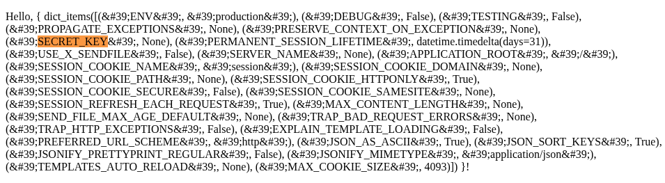

# Cybersecurity M01 - EX00

## Template Injection
(acontece com engines de template como Jinja2, Twig, Smarty, Freemarker)

Código com problema:
```py
user_input = request.form.get('input')
template = f'Hello, {{ {user_input} }}!'
result = render_template_string(template)
```

O que o usuário digita está sendo inserido sem tratamento
Isso permite para um hacker:
1. fazer uma Execução Remota de código (RCE) 
O atacante consegue colocar código Python dentro do template e executá-lo
```py
{{21*2}}
```

2. Pegar dados sensíveis:
- ler variáveis de ambiente/arquivos sensíveis
- ler atributos de objetos Flask/Django, como `config`
```py
{{ config.items() }}
{{ config['SECRET_KEY'] }}
```


- Acessar request e vazar cookies, cabeçalhos, ou o corpo da requisição
acessar atributos de objetos e arquivos do sistema

3. Pode conseguir fazer um XSS/HTML Injection persistente ou mudar a lógica de renderização para que o servidor renderize páginas diferentes

4. Backdoors persistentes:
- alteração de arquivos locais (como o requirements.txt)
- incluir código malicioso que será executado em cada renderização
- criar um "webshell" persistente dentro do template

5. Pode descobrir serviços internos sendo executados no mesmo servidor, acessar banco de dados ou atacar outros serviços

6. Pode fazer exploração e reconhecimento do ambiente, para verificar o que pode ser explorado/atacado e fazer ataques mais direcionados
- descobrir que template de engine está sendo usada 
- enumerar objetos disponíveis (via .__class__, __mro__, __subclasses__())
